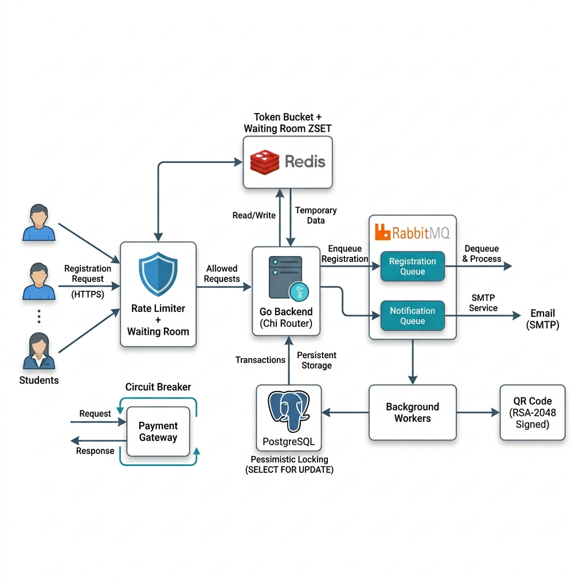
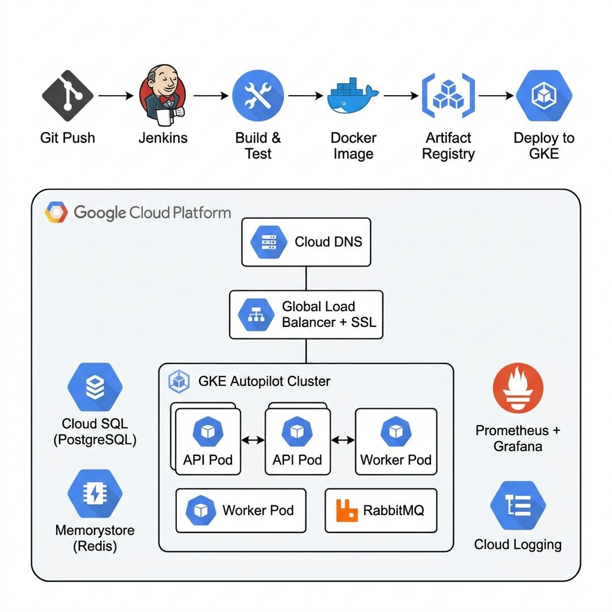

<p align="center">
  
</p>

<h1 align="center">🎓 UniHub Workshop</h1>
<p align="center">
  <strong>High-Concurrency Event Management Platform for Universities</strong>
</p>
<p align="center">
  Hệ thống quản lý, đăng ký và check-in sự kiện (Tuần lễ kỹ năng và nghề nghiệp) tải trọng cao dành cho sinh viên và ban tổ chức.
</p>

<p align="center">
  
  
  
  
  
  
  
</p>

---

## 🌟 Tính năng nghiệp vụ

| Vai trò | Tính năng |
|---------|-----------|
| **Sinh viên** | Xem danh sách workshop, sơ đồ phòng, trạng thái ghế trống (thời gian thực). Đăng ký (miễn phí/trả phí) và nhận mã QR qua email. |
| **Ban tổ chức (Admin)** | Quản lý sự kiện, tải lên PDF để AI tóm tắt nội dung tự động, Import CSV 12,000 sinh viên. Xem thống kê hệ thống. |
| **Nhân sự Check-in (Staff)** | Quét mã QR tại cửa hội trường bằng ứng dụng di động. Hỗ trợ ghi nhận **Offline (Mất mạng hoàn toàn)** và tự động đồng bộ khi có Internet. |

---

## 🏗️ Kiến trúc Backend (System Architecture)

<p align="center">
  
</p>

### Các cơ chế kỹ thuật nổi bật

| # | Cơ chế | Mô tả |
|---|--------|-------|
| 1 | **Pessimistic Locking** | `SELECT FOR UPDATE` trong PostgreSQL đảm bảo giao dịch an toàn khi hàng trăm thread tranh chấp chỗ ngồi. |
| 2 | **Rate Limiting & Waiting Room** | Thuật toán **Token Bucket** trên Redis chống Spam API. **Virtual Waiting Room** (Redis ZSET) đưa sinh viên vào phòng chờ khi quá tải. |
| 3 | **Event-Driven Architecture** | RabbitMQ bóc tách luồng Đăng ký và Thông báo thành Worker độc lập, phản hồi API dưới 10ms. |
| 4 | **Circuit Breaker & Idempotency** | Khóa Luỹ đẳng chặn trừ tiền 2 lần. Circuit Breaker "Ngắt mạch" (Fail Fast) khi hệ thống thanh toán sập. |
| 5 | **RSA-2048 Digital Signature** | App Mobile nhận Public Key để tự verify vé thật/giả ngay cả khi Offline. |
| 6 | **AI Pipe-and-Filter** | Trích xuất PDF → Làm sạch → Gọi Google Gemini API để tóm tắt học thuật. |
| 7 | **Batch Import CSV** | Phân tách 12,000 sinh viên thành Chunks, ghi đè bằng `INSERT ... ON CONFLICT DO UPDATE`. |

---

## ☁️ Hạ tầng DevOps trên GCP (Production Deployment)

<p align="center">
  
</p>

| Thành phần | Công nghệ |
|------------|-----------|
| **Compute** | GKE Autopilot (Horizontal Pod Autoscaler: 2→20 pods) |
| **Database** | Cloud SQL for PostgreSQL (Private IP, Automated Backup) |
| **Cache** | Memorystore for Redis (Private IP) |
| **Message Queue** | RabbitMQ trên GKE (Helm Chart) |
| **Networking** | VPC, Cloud DNS, Global HTTP(S) Load Balancer, Cloud Armor WAF, Cloud NAT |
| **CI/CD** | Jenkins Pipeline → Build → Test → Docker Image → Artifact Registry → Rolling Deploy |
| **Monitoring** | Prometheus + Grafana, Cloud Logging, Alerting |
| **Security** | Google Secret Manager, Network Policy, Non-root containers |
| **IaC** | Terraform (Infrastructure as Code) |

---

## 📁 Cấu trúc Dự án

```
unihub-workshop/
├── src/
│   ├── backend/          # Go API Server + Background Workers
│   │   ├── cmd/server/   # Entrypoint (main.go)
│   │   ├── internal/     # Handler, Service, Repository, Middleware, Config
│   │   ├── migrations/   # Database schema & seed data
│   │   └── Dockerfile
│   ├── web/              # Next.js Frontend (Admin + Student)
│   └── mobile/           # React Native (Expo) - Staff Check-in App
├── deploy/               # DevOps & Infrastructure
│   ├── terraform/        # GCP Infrastructure as Code
│   ├── k8s/              # Kubernetes manifests
│   ├── jenkins/          # CI/CD pipeline (Jenkinsfile)
│   └── monitoring/       # Grafana + Prometheus config
├── docs/images/          # Ảnh minh hoạ cho README
└── blueprint/            # Design docs & specs
```

---

## ⚙️ Hướng dẫn cài đặt và khởi chạy (Local Development)

> **Yêu cầu môi trường:** `Docker & Docker Compose`, `Node.js (v18+)`, `Golang (v1.22+)`.

### Bước 1: Khởi động Hạ tầng (Database & Message Broker)

```bash
cd src/backend
docker-compose up -d
```

Lệnh này sẽ khởi động:
- **PostgreSQL** (port `5433`) — Schema Database tự động chạy qua `init_schema.sql`
- **Redis** (port `6379`)
- **RabbitMQ** (port `5672` / Management UI: `15672`)

### Bước 2: Chạy Backend

```bash
cp .env.example .env    # Tạo file cấu hình
go mod tidy
go run cmd/server/main.go
```

Backend sẽ chạy tại: `http://localhost:8080`

### Bước 3: Chạy Web Frontend

```bash
cd src/web
npm install
npm run dev
```

Trang Web sẽ khởi chạy tại: `http://localhost:3000`

### Bước 4: Chạy Mobile App (Staff Check-in)

```bash
cd src/mobile
npm install
npx expo start --clear
```

Sử dụng ứng dụng **Expo Go** trên điện thoại để quét mã QR trên Terminal.

> **Lưu ý:** Nếu test bằng điện thoại vật lý, hãy đổi IP trong file `api.ts` để gọi API qua Local Area Network.

---

## 🔑 Dữ liệu mẫu (Seed Data)

**Tài khoản Admin:**
| Field | Value |
|-------|-------|
| Username | `admin` (hoặc `admin@unihub.edu.vn`) |
| Password | `admin123` |

**Test Tính Năng Sinh Viên:**
1. Đăng nhập Admin → Vào mục **Sinh viên** → Upload file `src/backend/data/sample_students_v2.csv`.
2. Đăng xuất → Dùng Email sinh viên trong file (Mật khẩu: `123456`) để đăng nhập và đăng ký Workshop.