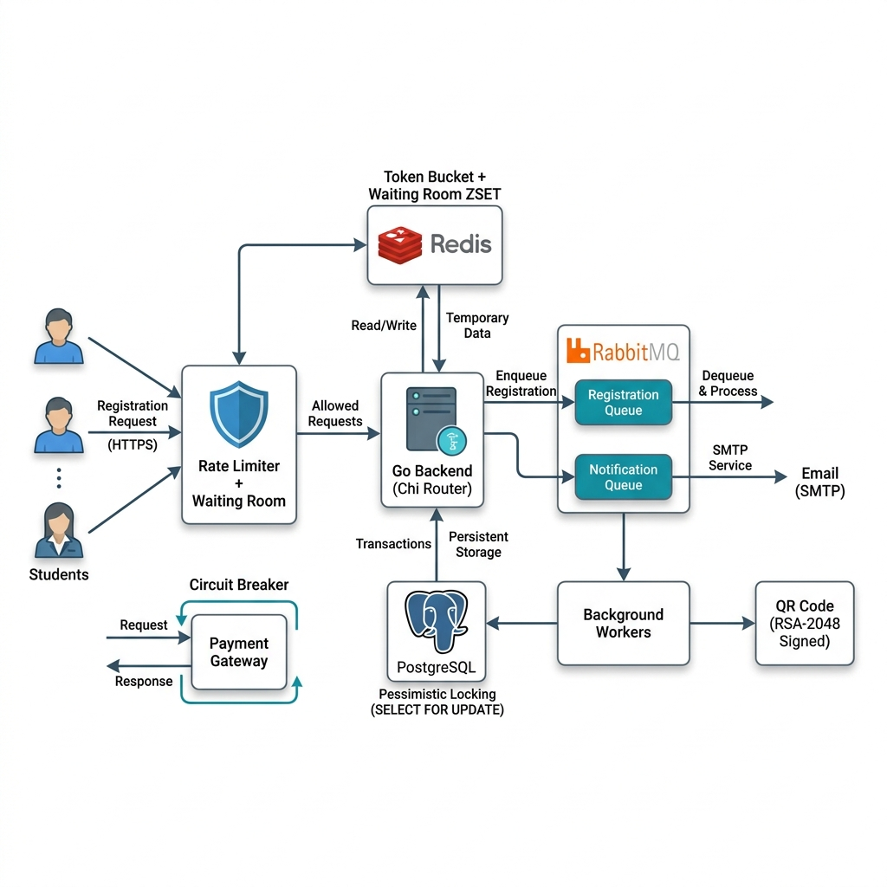
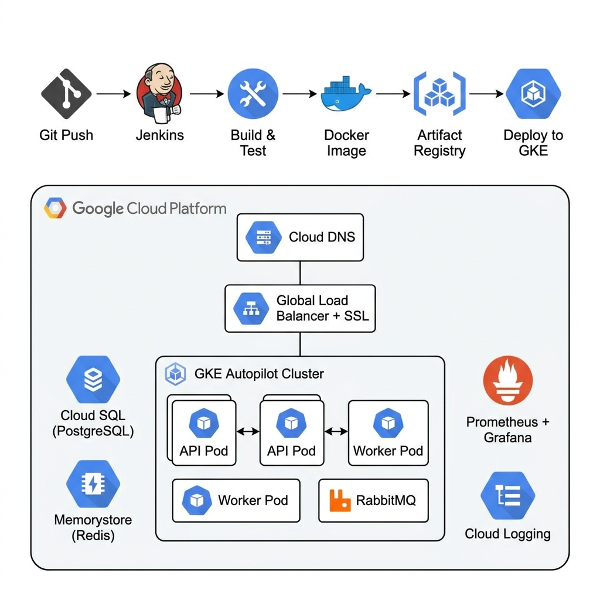

<p align="center">
  
</p>

<h1 align="center">🎓 UniHub Workshop Platform</h1>

<p align="center">
  <strong>Enterprise-Grade, High-Concurrency Event Ticketing & Offline-First Verification Platform</strong>
</p>

<p align="center">
  A distributed, cloud-native system engineered to handle extreme flash-crowd workshop registrations, offline cryptographic ticket validation, and automated GitOps infrastructure.
</p>

<p align="center">
  
  
  
  
  
  
  
  
  
  
</p>

---

## 📑 Table of Contents
- [Executive Overview](#-executive-overview)
- [System Architecture](#-system-architecture)
- [Key Engineering & Concurrency Highlights](#-key-engineering--concurrency-highlights)
- [Verified Concurrency Benchmarks](#-verified-concurrency-benchmarks)
- [DevOps, GitOps & Cloud Infrastructure](#-devops-gitops--cloud-infrastructure)
- [Repository Structure](#-repository-structure)
- [Quick Start Guide (Local Development)](#-quick-start-guide-local-development)
- [Seed Data & Demo Credentials](#-seed-data--demo-credentials)
- [License & Contributions](#-license--contributions)

---

## 🌟 Executive Overview

During university-wide career and technical workshop weeks, thousands of students compete simultaneously for limited seating capacities (50–500 seats) within the very first seconds of registration opening. Traditional monolithic systems fail under these flash-crowds due to database connection pool exhaustion, pessimistic lock contention, and cascading service outages.

**UniHub Workshop** solves this with a **zero-overbooking, multi-tier asynchronous architecture**:
1. **Students (Web App):** Real-time seat visibility, sub-millisecond virtual waiting room queueing, automated polling, and cryptographic QR ticket delivery.
2. **Event Organizers (Admin Portal):** Event lifecycle management, automated AI academic summarization via Google Gemini, and streaming chunked batch imports for up to 12,000 student accounts.
3. **Event Staff (Mobile App):** Real-time gate check-in with **offline-first cryptographic verification** (validating RSA-2048 digital signatures locally without internet access) and background conflict-resolution syncing.

---

## 🏗️ System Architecture

<p align="center">
  
</p>

### End-to-End Request Lifecycle
```
[2,000+ Concurrent Students]
           │  HTTP POST /api/v1/registrations (Bearer JWT)
           ▼
   ┌────────────────────────────────┐
   │ Nginx Gateway / API Replicas   │
   └───────┬────────────────────────┘
           │
           ├──> [1. Virtual Waiting Room (Redis ZSET)] ── (If overloaded, holds traffic)
           │
           ├──> [2. Atomic Seat Limiter (Redis Lua Script)] ── (Fast-fail if 0 seats)
           │
           ├──> [3. RabbitMQ Registration Queue] ── (Producer acknowledges HTTP 202 in <1ms)
           │
           ▼
   ┌────────────────────────────────┐
   │ Background Worker Pool (32 W)  │  <── Pulls with rate-regulated Prefetch Count
   └───────┬────────────────────────┘
           │
           ├──> [4. Compute RSA-2048 Digital Signature in-memory (outside DB transaction)]
           │
           ├──> [5. PostgreSQL Pessimistic Lock (SELECT ... FOR UPDATE)]
           │         • Decrement available_seats (strictly > 0)
           │         • Insert registration with pre-computed ticket_signature
           │         • Transaction committed in < 2ms (Zero lock contention)
           │
           ├──> [6. Cache Status in Redis (TTL: 1 Hour)]
           │
           └──> [7. RabbitMQ Notification Queue] ──> SMTP Worker delivers confirmation email
```

---

## 🚀 Key Engineering & Concurrency Highlights

### 1. Zero-Overbooking via Dual-Layer Concurrency Control
* **Layer 1 (In-Memory Atomic Gate):** Redis Lua scripts execute atomic seat deductions before requests ever touch the relational database. If seats are depleted, subsequent requests are rejected or placed in a virtual queue immediately.
* **Layer 2 (Database Transaction Optimization):** In PostgreSQL, seats are decremented with pessimistic locking (`SELECT available_seats FROM workshops WHERE id = $1 FOR UPDATE`).
* **Critical Lock Optimization:** Heavy cryptographic operations (RSA-2048 signature generation and SHA-256 hashing) are **pre-computed in-memory outside the database transaction**, shrinking the row lock duration from ~25ms down to **< 2ms**, completely eliminating lock timeouts under heavy bursts.

### 2. Elimination of In-Memory Memory Leaks (Redis Status TTL)
* Asynchronous registration statuses (`PROCESSING`, `SUCCESS`, `REJECTED`) are persisted directly into Redis with key pattern `reg:status:<correlation_id>` and a strict **1-hour TTL (`1 * time.Hour`)**.
* Completely removes unbounded in-memory Go maps, preventing heap degradation over long-running production uptime while providing sub-millisecond polling responses to clients.

### 3. Concurrency-Safe Circuit Breaker
* Custom-built Circuit Breaker protecting third-party dependencies (AI APIs, Mail servers) featuring:
  * **Thread-safe state transitions** across `CLOSED`, `OPEN`, and `HALF_OPEN`.
  * **Atomic probe limiting** in `HALF_OPEN` state to prevent thundering-herd probes.
  * **Panic recovery middleware** ensuring faulty workers never crash the main daemon.

### 4. Offline-First Cryptographic Check-in
* Tickets contain an RSA-2048 digital signature encoding `workshop_id:student_id:issued_at`.
* Mobile devices cache the server's public key upon authentication. During event check-in in basements or crowded auditoriums with **zero network connectivity**, the staff application verifies tickets locally using PKCS#1 v1.5 verification.
* When connectivity resumes, up to 500 offline check-in logs are synchronized in batches with deterministic timestamp conflict resolution.

### 5. High-Throughput Batch Account Ingestion
* Handles bulk onboarding of 12,000 university students via streaming CSV parsing.
* Batched into chunks of 500 records using PostgreSQL `INSERT ... ON CONFLICT (user_id) DO UPDATE` (upsert), completing full university imports in seconds without memory spikes.

---

## 📊 Verified Concurrency Benchmarks

Stress tests were conducted using the built-in Go benchmarking engine (`cmd/concurrency_demo`) simulating a true simultaneous gate barrier (all goroutines aligned at 0ms starting gun):

<p align="center">
  
</p>

| Benchmark Scenario | Traffic Profile | CPU Allocation | Throughput (RPS) | Avg Latency | P95 Latency | Seats Allocated | Overbooking |
| :--- | :--- | :--- | :--- | :--- | :--- | :--- | :--- |
| **Simultaneous Gate Burst (16 Cores)** | 3,000 users @ 0ms | 16 vCPUs | **2,235.1 req/s** | 1.34 ms | 2.12 ms | 100 / 100 | **0 (0.00%)** |
| **Simultaneous Gate Burst (Strict 2 Cores)** | 2,000 users @ 0ms | 2 vCPUs (`taskset -c 0,1`) | **1,754.4 req/s** | 0.96 ms | 1.84 ms | 100 / 100 | **0 (0.00%)** |
| **Sustained Traffic Pool** | 2,000 users over 3s | 2 vCPUs | **658.2 req/s** | 0.96 ms | 1.45 ms | 50 / 50 | **0 (0.00%)** |

> **Audit Result:** Across all cycles, connection errors were **0**, dropped sockets were **0**, and database consistency was verified at **100.00%** with zero seat anomalies.

---

## ☁️ DevOps, GitOps & Cloud Infrastructure

The platform is designed around CNCF Cloud-Native and Twelve-Factor App standards:

```text
Git Commit ──> Argo Workflows DAG (Lint, Race Tests, Docker Multi-stage Build, k6 Gate)
                     │
                     ▼
               Update Helm Values (deploy/helm/unihub)
                     │
                     ▼
               ArgoCD Controller (Declarative Sync Waves, Self-Healing)
                     │
                     ▼
               Kubernetes Cluster (GKE / KinD)
               ├── Wave 1: PostgreSQL, Redis, RabbitMQ
               ├── Wave 2: DB Schema Migrations Job
               ├── Wave 3: UniHub API & Worker Deployments (HPA Autoscaling)
               └── Wave 4: Ingress Routes & Prometheus PodMonitors
```

* **Infrastructure as Code (IaC):** Complete GCP foundation managed via **Terraform** (`deploy/terraform/`), provisioning VPC, GKE Autopilot clusters, Cloud SQL, Memorystore, Cloud NAT, and Cloud Armor WAF.
* **Declarative Packaging:** Packaged with **Helm 3** (`deploy/helm/unihub`) with environment-isolated configurations (`values-staging.yaml`, `values-prod.yaml`).
* **Continuous Delivery:** Orchestrated with **ArgoCD GitOps** (`deploy/gitops/`) utilizing Kubernetes **Sync Waves** to guarantee clean dependency ordering between databases, migrations, and microservices.
* **Automated CI & Quality Gates:** Cloud-native DAG workflows using **Argo Workflows** (`deploy/ci/argo-workflows/`) and **GitHub Actions**, enforcing automated regression gates where pipelines terminate if p95 latency exceeds 200ms.
* **Telemetry & Observability:** Prometheus Operator CRDs (`PodMonitor`), Grafana dashboards, and structured JSON logs indexed via **Fluent-bit** into **OpenSearch**.

---

## 📁 Repository Structure

The monorepo follows a clean domain-driven layout:

```text
Unihub-workshop/
├── Makefile                     # ⚡ 1-Click developer entrypoint (make dev, make bench, etc.)
├── docker-compose.yml           # Root Docker Compose (delegates to deploy/docker)
│
├── deploy/                      # 🚀 DevOps, Infrastructure & GitOps Center
│   ├── docker/                  # 16-replica local container stack (Docker Compose + Nginx)
│   ├── helm/                    # Helm 3 Charts (unihub: API, Worker, HPA, PodMonitor)
│   ├── gitops/                  # ArgoCD Application manifests, App-of-Apps & Sync Waves
│   ├── ci/                      # Cloud-Native CI (Argo Workflows DAGs & Legacy Jenkinsfile)
│   ├── k8s/                     # Raw Kubernetes manifests (Namespace, Ingress, HPA)
│   ├── terraform/               # GCP Infrastructure as Code (GKE, VPC, CloudSQL, MemoryStore)
│   └── observability/           # Centralized Telemetry (Fluent-bit, OpenSearch, Prometheus)
│
├── scripts/                     # 🛠️ Categorized Automation Scripts
│   ├── dev/                     # Local startup scripts (start_backend.sh, start_backend_2cpu.sh)
│   ├── benchmark/               # Concurrency gate runners (run_concurrency_test.sh)
│   └── k8s/                     # Cluster bootstrapping (deploy_minikube.sh)
│
├── src/                         # 💻 Application Source Code
│   ├── backend/                 # Golang High-Concurrency Backend (Clean Architecture)
│   │   ├── cmd/server/          # API & Worker runtime entrypoint
│   │   ├── cmd/concurrency_demo/# Real-time gate load testing & benchmark tool
│   │   ├── internal/            # Service, Repository, Queue, SeatLimiter, WaitingRoom
│   │   └── Dockerfile           # Optimized multi-stage container build
│   ├── web/                     # Next.js 15 Web Frontend (Admin & Student portals)
│   └── mobile/                  # React Native Expo Check-in App (Offline-first)
│
├── docs/                        # 📚 Architectural Blueprints & Implementation Plans
│   ├── images/                  # Architecture schematics & benchmark charts
│   └── DEVOPS_IMPLEMENTATION_PLAN.md
└── blueprint/                   # Design specifications & course documentation
```

---

## ⚙️ Quick Start Guide (Local Development)

### Prerequisites
* **Docker & Docker Compose** (Docker Engine v24+)
* **Go** (v1.22+)
* **Node.js** (v18+) & `npm` / `pnpm`
* **GNU Make**

### 1. 1-Click Execution via Makefile (Recommended)

```bash
# Display all available automated targets
make help

# 1. Start the entire 16-container local stack (Postgres, Redis, RabbitMQ, API, Workers, Web)
make dev

# 2. Run Go Unit Tests with ThreadSanitizer data race detection
make test

# 3. Fire an instant concurrency stress test (50 users, 25 slots)
make bench

# 4. Fire full simultaneous 0ms gate burst stress test (2,000 users)
make bench-2k

# 5. Stop and clean up all containers
make dev-down
```

---

### 2. Manual Service Execution (Step-by-Step)

#### Step 1: Start Infrastructure Containers
```bash
docker compose up -d
```
* **PostgreSQL:** `localhost:5433` (Auto-migrated with schema & seed data)
* **Redis:** `localhost:6379`
* **RabbitMQ:** `localhost:5672` (Management Dashboard: `http://localhost:15672` | `guest/guest`)
* **MailHog:** `localhost:1025` (Web UI: `http://localhost:8025`)
* **Nginx Gateway:** `http://localhost:8080`, `http://localhost:3000`

#### Step 2: Run Go Backend Server
```bash
# Pin backend execution strictly to 2 CPU Cores to simulate constrained environments
./scripts/dev/start_backend_2cpu.sh

# Or run with all available CPU cores:
./scripts/dev/start_backend.sh
```
Health Check Endpoint: `http://localhost:8080/health`

#### Step 3: Run Web Frontend
```bash
cd src/web
npm install
npm run dev
```
Web Application: `http://localhost:3000`

#### Step 4: Run Mobile Staff Check-in App
```bash
cd src/mobile
npm install
npx expo start --clear
```
Scan the terminal QR code using **Expo Go** on iOS or Android.

---

## 🔑 Seed Data & Demo Credentials

### Pre-configured Accounts
| Role | Identifier / Email | Password | Access Capabilities |
| :--- | :--- | :--- | :--- |
| **System Admin** | `admin` (or `admin@unihub.edu.vn`) | `admin123` | Full control: Event CRUD, AI summarization, CSV student batch ingestion, Metrics |
| **Student** | `student1@unihub.edu.vn` | `123456` | Browse workshops, join virtual waiting room, reserve seats, view QR ticket |
| **Staff Member**| `staff1@unihub.edu.vn` | `123456` | Offline/Online QR ticket scanner via mobile application |

### Ready-to-use Sample Datasets
* **12,000 Student Ingestion:** Test bulk processing via Admin Portal by uploading [`src/backend/data/sample_students_v2.csv`](file:///home/tuna/learn/se/Unihub-workshop/src/backend/data/sample_students_v2.csv).
* **AI Workshop Extraction:** Upload sample conference PDFs to test Google Gemini automatic topic and syllabus summarization.

---

## 👥 Authors & Acknowledgments

* **Đinh Tuấn Duy** ([@dtduy23](https://github.com/dtduy23)) — Core System Architecture, Concurrency Engineering, Backend & DevOps Pipelines.
* Developed as an advanced high-concurrency capstone engineering platform.