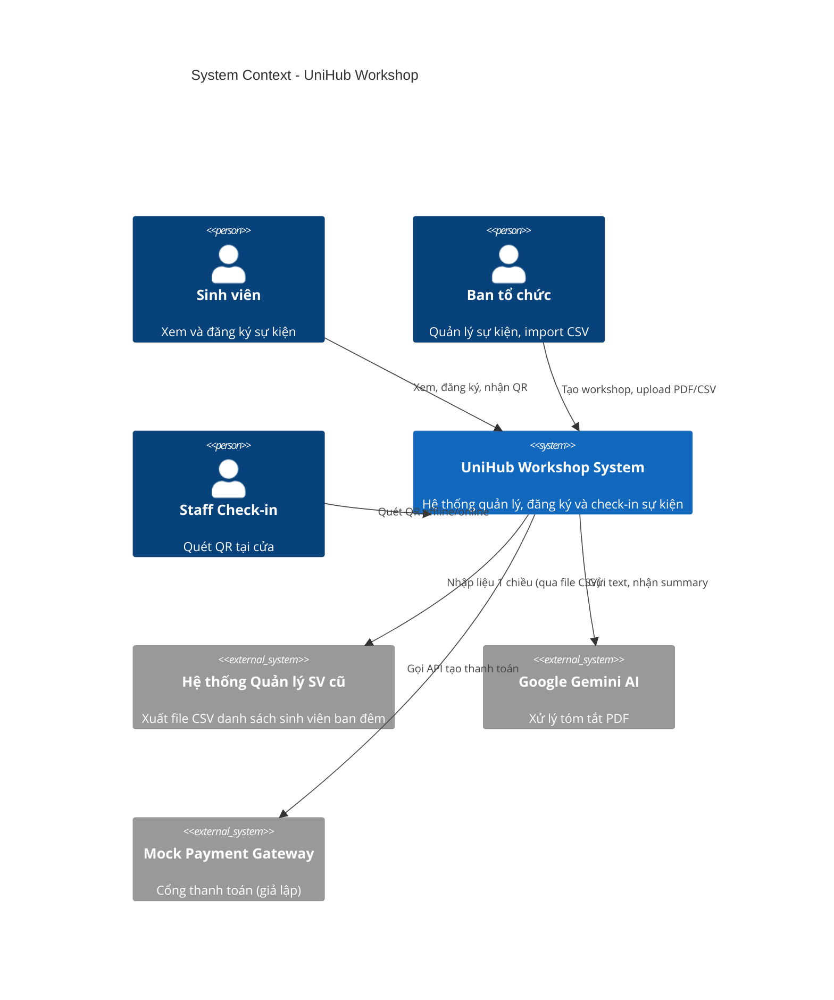
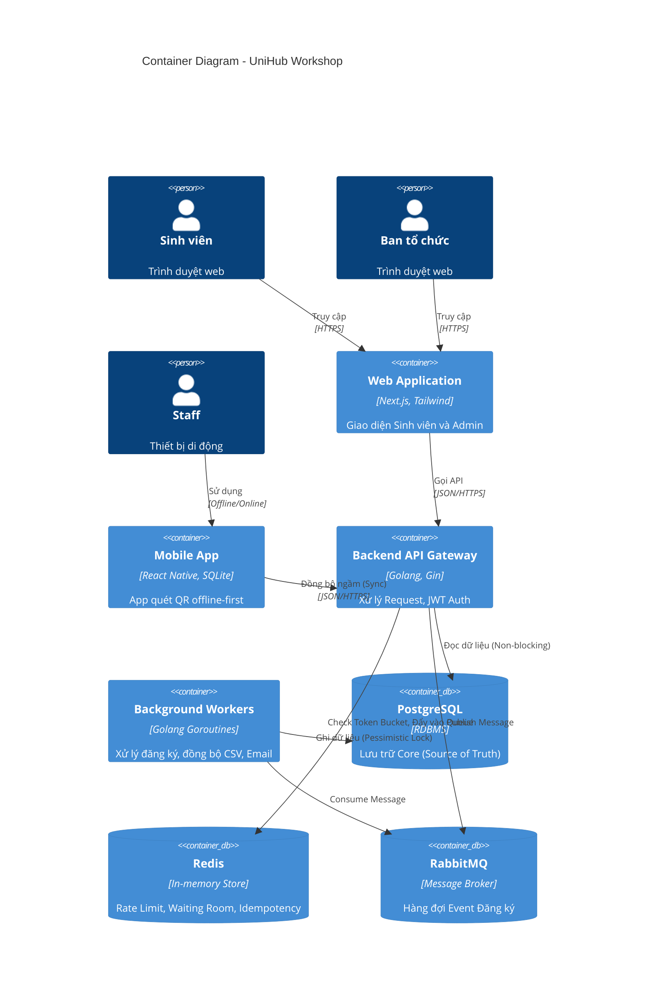
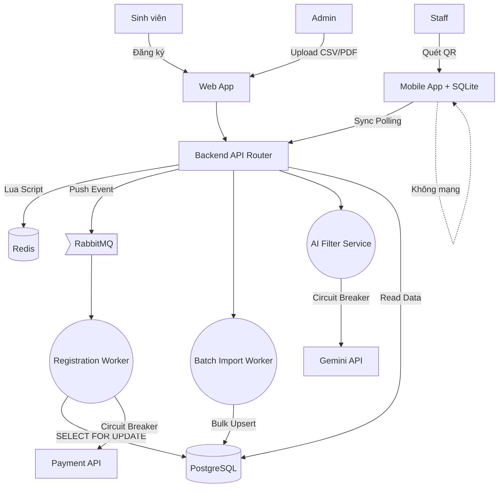

# UniHub Workshop — Technical Design

## Kiến trúc tổng thể
Hệ thống sử dụng **Kiến trúc Hỗn hợp (Hybrid Architecture)** nhằm tối ưu hóa khả năng mở rộng và độ tin cậy:
- **Layered Architecture (Kiến trúc phân tầng):** Áp dụng tại Backend (Golang) với các tầng Handler, Service, và Repository để phân tách rõ ràng trách nhiệm.
- **Event-Driven Architecture (Kiến trúc hướng sự kiện):** Áp dụng cho luồng đăng ký. API tiếp nhận request, đẩy Message (Event) vào RabbitMQ và phản hồi ngay lập tức (Load Leveling). Background Workers sẽ tiêu thụ sự kiện này để trừ ghế.
- **Pipe-and-Filter:** Áp dụng cho luồng AI Summary. Dữ liệu văn bản từ PDF chảy qua các Filter (Extract -> Clean -> AI Call) để dễ xử lý và bảo trì.
- **Offline-first Architecture:** Áp dụng cho Mobile App. Dữ liệu xử lý, xác thực RSA được thực hiện cục bộ trên SQLite và đồng bộ lên server khi có mạng (Eventual Consistency).

## C4 Diagram

### Level 1 — System Context
Sơ đồ mô tả UniHub Workshop trong mối tương quan với các Actor và các External Systems.

### Level 2 — Container
Phân rã hệ thống thành các đơn vị phân phối và vận hành.

## High-Level Architecture Diagram
Sơ đồ luồng dữ liệu chi tiết, đặc biệt nhấn mạnh các điểm tích hợp.

## Thiết kế cơ sở dữ liệu
Hệ thống triển khai chiến lược **Polyglot Persistence**:
- **PostgreSQL (RDBMS):** Đóng vai trò Source of Truth. Chọn SQL vì dữ liệu đăng ký và thanh toán mang tính chất giao dịch cao (Transactional), cần tuân thủ tính ACID và đảm bảo Data Integrity (Ràng buộc Unique `student_id, workshop_id`). Schema chính: `users`, `workshops`, `registrations`.
- **Redis (NoSQL In-memory):** Tối ưu hóa đọc/ghi tốc độ siêu cao. Chọn Redis để triển khai Token Bucket (Rate Limiter), Virtual Waiting Room (ZSET Queue) và lưu khóa Idempotency TTL 5 phút.
- **SQLite (Mobile DB):** Cơ sở dữ liệu nhúng siêu nhẹ trên điện thoại Staff. Bắt buộc có để lưu trữ bản ghi check-in tạm thời (`status = PENDING`) khi hoạt động ở khu vực hội trường không có Internet.

## Thiết kế kiểm soát truy cập
Hệ thống sử dụng **Role-Based Access Control (RBAC)** kết hợp **JSON Web Tokens (JWT)**:
- **Authentication:** Mọi request đều gửi JWT trong header `Authorization: Bearer <token>`. Đảm bảo tính Stateless.
- **Authorization:** API được bảo vệ bởi Middleware kiểm tra trường `role` trong payload của JWT.
  - Sinh viên (`STUDENT`): Truy cập GET workshop, POST đăng ký.
  - Ban tổ chức (`ADMIN`): Truy cập POST/PUT/DELETE workshop, upload CSV/PDF, xem thống kê.
  - Nhân sự check-in (`STAFF`): Chỉ truy cập POST `/api/v1/checkin/sync`.

## Thiết kế các cơ chế bảo vệ hệ thống

### Kiểm soát tải đột biến
**Vấn đề:** 12,000 sinh viên xông vào lúc mở cổng.
**Giải pháp:** 
- Tầng 1: **Token Bucket Rate Limiting** bằng Redis Lua Script. Giới hạn 5000 request/giây để chống Spam/DDoS. Vượt ngưỡng -> HTTP 429.
- Tầng 2: **Virtual Waiting Room (ZSET)**. Giới hạn số connection đồng thời vào hệ thống. Những người dùng vượt quá `Max Active` sẽ bị đưa vào hàng đợi Redis ZSET (điểm số là Timestamp). Trả về HTTP 202 Queued. Cứ mỗi vài giây, cron job sẽ "promote" những người xếp hàng lâu nhất vào xử lý.

### Xử lý cổng thanh toán không ổn định
**Vấn đề:** API Payment chậm, timeout làm treo thread hệ thống, kéo sập toàn bộ dịch vụ khác.
**Giải pháp:** **Circuit Breaker Pattern** với Graceful Degradation.
- Hệ thống theo dõi % lỗi từ cổng thanh toán. Nếu số request lỗi vượt ngưỡng 50% trong thời gian ngắn -> Đóng mạch (OPEN state).
- Khi mạch OPEN, mọi request đăng ký lớp CÓ PHÍ sẽ bị từ chối ngay lập tức (Fail Fast) trong 30 giây để không gây treo pool. Trong khi đó, luồng xem lịch, luồng đăng ký lớp MIỄN PHÍ vẫn hoạt động bình thường (Graceful Degradation).
- Sau 30s, mạch chuyển sang HALF-OPEN để cho qua 1 vài request test thử cổng thanh toán.

### Chống trừ tiền hai lần
**Vấn đề:** Mạng lag, app retry liên tục sinh ra 2 request đăng ký giống hệt nhau, trừ tiền 2 lần.
**Giải pháp:** **Idempotency Key**.
- Khi bấm nút Đăng ký, Backend sinh ra hoặc nhận một chuỗi Unique ID (Idempotency Key).
- Key này được lưu vào **Redis bằng lệnh `SETNX` (Set if Not Exists)** với TTL (hết hạn) 5 phút. 
- Lần gọi đầu tiên, Redis trả về True -> Cho xử lý.
- Lần gọi thứ 2 (do retry hoặc click đúp), Redis báo Key đã tồn tại -> Từ chối xử lý và trả về ngay kết quả của lần 1. Đảm bảo giao dịch chỉ chạy 1 lần duy nhất.

## Các quyết định kỹ thuật quan trọng (ADR)

| Quyết định kỹ thuật | Tại sao chọn? | Đánh đổi (Trade-off) |
| :--- | :--- | :--- |
| **RabbitMQ (Event-Driven)** | Phản hồi API đăng ký tức thì, điều hòa lưu lượng ghi vào DB. | Tăng độ phức tạp vận hành, cần thiết kế kiến trúc bất đồng bộ ở Frontend. |
| **Pessimistic Locking (Postgres)** | `SELECT FOR UPDATE` ngăn triệt để việc bán lố vé khi tranh chấp. | Row bị lock sẽ làm chậm các giao dịch khác tranh giành cùng 1 workshop. |
| **RSA-2048 Digital Signatures** | Cho phép App verify QR Code vé là HÀNG THẬT 100% khi mất mạng (Offline). | App Mobile bị phình to do chứa thuật toán mã hóa; rủi ro lộ Public Key. |
| **Bulk Upsert (UNNEST)** | Import file CSV 12,000 học sinh chỉ trong 1 câu SQL, chống treo server. | Câu SQL trở nên phức tạp, khó gỡ lỗi hơn vòng lặp ORM thông thường. |
