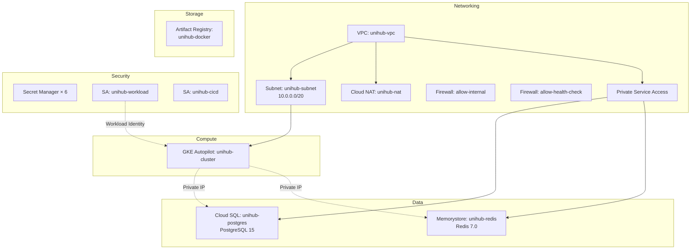

# 📋 Danh sách Tài nguyên GCP đã tạo — UniHub Workshop

> **Ngày tạo:** 31/05/2026
> **Công cụ:** Terraform v1.5+ với Google Provider v5.45.2
> **Project ID:** `test-projectproject`
> **Region:** `asia-southeast1` (Singapore)
> **Zone:** `asia-southeast1-a`

---

## Tổng quan kiến trúc



---

## 1. GCP APIs đã bật (10 APIs)

| # | API | Mục đích |
|---|-----|----------|
| 1 | `compute.googleapis.com` | VPC, Firewall, Load Balancer |
| 2 | `container.googleapis.com` | Google Kubernetes Engine |
| 3 | `sqladmin.googleapis.com` | Cloud SQL quản trị |
| 4 | `redis.googleapis.com` | Memorystore Redis |
| 5 | `artifactregistry.googleapis.com` | Docker Image Registry |
| 6 | `secretmanager.googleapis.com` | Quản lý secrets mã hóa |
| 7 | `dns.googleapis.com` | Cloud DNS |
| 8 | `servicenetworking.googleapis.com` | Private Service Access (VPC Peering) |
| 9 | `cloudresourcemanager.googleapis.com` | Quản lý project |
| 10 | `iam.googleapis.com` | Phân quyền |

> **Lưu ý:** `disable_on_destroy = false` — khi chạy `terraform destroy`, các API vẫn được giữ bật.

---

## 2. Networking (VPC)

### 2.1 VPC Network

| Thuộc tính | Giá trị |
|------------|---------|
| **Tên** | `unihub-vpc` |
| **Auto-create subnets** | `false` (quản lý thủ công) |
| **Routing mode** | `REGIONAL` |
| **Terraform resource** | `google_compute_network.vpc` |

### 2.2 Subnet

| Thuộc tính | Giá trị |
|------------|---------|
| **Tên** | `unihub-subnet` |
| **Primary CIDR** | `10.0.0.0/20` (4,094 IPs — cho GKE Nodes, SQL, Redis) |
| **Secondary "pods"** | `10.4.0.0/14` (262,142 IPs — mỗi Pod 1 IP riêng) |
| **Secondary "services"** | `10.8.0.0/20` (4,094 IPs — Kubernetes ClusterIP Services) |
| **Private Google Access** | `true` |
| **Terraform resource** | `google_compute_subnetwork.main` |

### 2.3 Cloud Router & Cloud NAT

| Thuộc tính | Giá trị |
|------------|---------|
| **Router** | `unihub-router` |
| **NAT** | `unihub-nat` |
| **NAT IP** | `AUTO_ONLY` (Google tự cấp phát) |
| **Scope** | `ALL_SUBNETWORKS_ALL_IP_RANGES` |
| **Log** | `ERRORS_ONLY` |
| **Mục đích** | Cho phép GKE Pods (Private IP) gọi ra internet (Gemini API, SMTP, npm...) |

### 2.4 Private Service Access

| Thuộc tính | Giá trị |
|------------|---------|
| **Reserved IP range** | `unihub-private-ip`, prefix `/16`, loại `INTERNAL` |
| **VPC Peering** | `servicenetworking.googleapis.com` |
| **Mục đích** | Cho Cloud SQL và Redis có Private IP trong VPC, traffic không đi qua internet |

### 2.5 Firewall Rules

| Rule | Tên | Source Ranges | Ports | Mục đích |
|------|-----|---------------|-------|----------|
| **allow-internal** | `unihub-allow-internal` | `10.0.0.0/20`, `10.4.0.0/14`, `10.8.0.0/20` | TCP/UDP 0-65535, ICMP | Giao tiếp nội bộ Pod ↔ Pod, Pod ↔ DB |
| **allow-health-check** | `unihub-allow-health-check` | `35.191.0.0/16`, `130.211.0.0/22` | TCP 80, 443, 8080 | Google Load Balancer health check |

---

## 3. Cloud SQL — PostgreSQL

| Thuộc tính | Giá trị |
|------------|---------|
| **Instance name** | `unihub-postgres` |
| **Engine** | PostgreSQL 15 |
| **Machine tier** | `db-custom-1-3840` (1 vCPU, 3.75 GB RAM) |
| **Availability** | `ZONAL` (single zone) |
| **Disk** | SSD (`PD_SSD`), khởi tạo 10 GB, tự mở rộng (`autoresize = true`) |
| **IP** | **Private IP only** (`ipv4_enabled = false`) |
| **Network** | VPC `unihub-vpc` qua Private Service Access |
| **Database name** | `unihub_workshop` |
| **Database user** | `unihub` |
| **Database password** | `97cd1231c2ba19b8f4abafe9ca2cc5d5` (stored in Secret Manager) |
| **Max connections** | `100` |
| **Slow query log** | Queries > 1 giây được ghi log |
| **Backup** | Tự động hàng ngày lúc 03:00 UTC (10:00 VN), giữ 7 bản |
| **PITR** | Point-in-Time Recovery: `enabled` |
| **Maintenance** | Chủ Nhật 03:00 UTC, kênh `stable` |
| **Deletion protection** | `false` (tắt để tiết kiệm credit, **bật ON khi production thật**) |
| **Terraform resources** | `google_sql_database_instance.postgres`, `google_sql_database.main`, `google_sql_user.app` |

---

## 4. Memorystore — Redis

| Thuộc tính | Giá trị |
|------------|---------|
| **Instance name** | `unihub-redis` |
| **Engine** | Redis 7.0 (`REDIS_7_0`) |
| **Tier** | `BASIC` (không HA — dùng `STANDARD_HA` cho production thật) |
| **Memory** | 2 GB |
| **Network** | VPC `unihub-vpc` (Private IP) |
| **Eviction policy** | `allkeys-lru` (khi đầy → xóa key ít dùng nhất) |
| **Keyspace events** | `Ex` (gửi notification khi key hết hạn TTL — dùng cho seat expiration) |
| **Maintenance** | Chủ Nhật 03:00 |
| **Terraform resource** | `google_redis_instance.cache` |

---

## 5. GKE — Kubernetes Cluster

| Thuộc tính | Giá trị |
|------------|---------|
| **Cluster name** | `unihub-cluster` |
| **Location** | `asia-southeast1` (regional) |
| **Mode** | **Autopilot** (Google quản lý 100% nodes, tự scale) |
| **Network** | VPC `unihub-vpc`, Subnet `unihub-subnet` |
| **Pod IP range** | Secondary range `pods` (`10.4.0.0/14`) |
| **Service IP range** | Secondary range `services` (`10.8.0.0/20`) |
| **Private nodes** | `true` (nodes không có Public IP) |
| **Private endpoint** | `false` (kubectl từ bên ngoài vẫn truy cập được) |
| **Master CIDR** | `172.16.0.0/28` |
| **Workload Identity** | `test-projectproject.svc.id.goog` |
| **Managed Prometheus** | `enabled` |
| **Logging** | `SYSTEM_COMPONENTS`, `WORKLOADS` |
| **Monitoring** | `SYSTEM_COMPONENTS`, `STORAGE`, `POD`, `DEPLOYMENT`, `STATEFULSET` |
| **Release channel** | `REGULAR` |
| **Maintenance** | Chủ Nhật 03:00–07:00 UTC |
| **Deletion protection** | `false` |
| **Terraform resource** | `google_container_cluster.autopilot` |

---

## 6. Artifact Registry — Docker Images

| Thuộc tính | Giá trị |
|------------|---------|
| **Repository name** | `unihub-docker` |
| **Format** | `DOCKER` |
| **Location** | `asia-southeast1` |
| **Cleanup policy** | Giữ tối đa 10 image mới nhất, tự xóa cũ |
| **URL đầy đủ** | `asia-southeast1-docker.pkg.dev/test-projectproject/unihub-docker` |
| **Terraform resource** | `google_artifact_registry_repository.docker` |

---

## 7. Secret Manager — 6 Secrets

| # | Secret ID | Nội dung | Sử dụng bởi |
|---|-----------|----------|--------------|
| 1 | `unihub-db-password` | Mật khẩu PostgreSQL | Pod → env `DB_PASSWORD` |
| 2 | `unihub-auth-secret` | JWT signing key (HMAC) | Auth middleware |
| 3 | `unihub-rsa-private-key` | RSA private key ký vé QR | Ticket service |
| 4 | `unihub-payment-webhook-secret` | Xác thực callback thanh toán | Payment handler |
| 5 | `unihub-smtp-pass` | Gmail App Password | Email notification service |
| 6 | `unihub-gemini-api-key` | Google Gemini API key | AI summary feature |

> **Replication:** Tất cả đều dùng `auto {}` — Google tự chọn region tối ưu để replicate.
> Mỗi secret gồm 2 resource: `google_secret_manager_secret` (container) + `google_secret_manager_secret_version` (giá trị thực).

---

## 8. IAM — Service Accounts & Roles

### 8.1 GKE Workload SA (cho ứng dụng chạy trên Pods)

| Thuộc tính | Giá trị |
|------------|---------|
| **Account ID** | `unihub-workload` |
| **Email** | `unihub-workload@test-projectproject.iam.gserviceaccount.com` |

**Quyền được gán (5 roles):**

| # | Role | Mục đích |
|---|------|----------|
| 1 | `roles/secretmanager.secretAccessor` | Đọc secrets (DB password, JWT key, API keys...) |
| 2 | `roles/artifactregistry.reader` | Pull Docker images từ Registry |
| 3 | `roles/cloudsql.client` | Kết nối Cloud SQL qua Private IP |
| 4 | `roles/logging.logWriter` | Ghi log vào Cloud Logging |
| 5 | `roles/monitoring.metricWriter` | Gửi metrics cho Cloud Monitoring / Prometheus |

**Workload Identity Bindings (2 bindings):**

| K8s ServiceAccount | Namespace | Mapping |
|--------------------|-----------|---------|
| `unihub-api` | `unihub` | → `unihub-workload` GCP SA |
| `unihub-worker` | `unihub` | → `unihub-workload` GCP SA |

### 8.2 CI/CD SA (cho Jenkins pipeline)

| Thuộc tính | Giá trị |
|------------|---------|
| **Account ID** | `unihub-cicd` |
| **Email** | `unihub-cicd@test-projectproject.iam.gserviceaccount.com` |

**Quyền được gán (2 roles):**

| # | Role | Mục đích |
|---|------|----------|
| 1 | `roles/artifactregistry.writer` | Push Docker images mới |
| 2 | `roles/container.developer` | Deploy (`kubectl apply`) lên GKE |

---

## 9. Cloud DNS (Conditional)

| Thuộc tính | Giá trị |
|------------|---------|
| **Trạng thái** | **KHÔNG TẠO** (`domain_name = ""`) |
| **Điều kiện** | `count = var.domain_name != "" ? 1 : 0` |
| **Nếu có domain** | Tạo zone `unihub-zone` với DNSSEC bật |

---

## 📊 Tổng kết số lượng Resources

| Nhóm | Số lượng | Chi tiết |
|------|----------|----------|
| **GCP APIs** | 10 | compute, container, sqladmin, redis, artifactregistry, secretmanager, dns, servicenetworking, cloudresourcemanager, iam |
| **Networking** | 7 | 1 VPC + 1 Subnet + 1 Router + 1 NAT + 1 Private IP Range + 2 Firewall Rules |
| **Cloud SQL** | 3 | 1 Instance + 1 Database + 1 User |
| **Memorystore** | 1 | 1 Redis Instance |
| **GKE** | 1 | 1 Autopilot Cluster |
| **Artifact Registry** | 1 | 1 Docker Repository |
| **Secret Manager** | 12 | 6 Secrets × 2 (container + version) |
| **IAM** | 9 | 2 Service Accounts + 7 Role Bindings |
| **DNS** | 0 | Conditional, chưa tạo |
| **TỔNG CỘNG** | **~44 resources** | |

---

## 🔗 Thông tin kết nối (Terraform Outputs)

Sau khi `terraform apply` hoàn tất, chạy `terraform output` để lấy các giá trị sau:

| Output | Lệnh | Dùng ở đâu |
|--------|-------|-------------|
| Cloud SQL Private IP | `terraform output cloudsql_private_ip` | K8s ConfigMap `DB_HOST` |
| Cloud SQL Connection Name | `terraform output cloudsql_connection_name` | Cloud SQL Proxy |
| Redis Address | `terraform output redis_addr` | K8s ConfigMap `REDIS_ADDR` |
| Docker Registry URL | `terraform output docker_registry_url` | `docker push/pull` |
| Workload SA Email | `terraform output workload_sa_email` | K8s ServiceAccount annotation |
| CI/CD SA Email | `terraform output cicd_sa_email` | Jenkins config |
| kubectl Config | `terraform output kubectl_config_command` | Kết nối GKE cluster |
| Docker Push | `terraform output docker_push_command` | Push backend image |

---

## ⚠️ Lưu ý quan trọng

> [!WARNING]
> **Secrets trong `terraform.tfvars`**: File này chứa mật khẩu, API keys, RSA private key. **KHÔNG ĐƯỢC commit lên Git.** Đảm bảo file đã nằm trong `.gitignore`.

> [!IMPORTANT]
> **Deletion Protection = false**: Cả Cloud SQL và GKE đều đang tắt bảo vệ xóa để tiện `terraform destroy`. **Bật ON (`true`) khi chuyển sang production thật** để tránh xóa nhầm.

> [!TIP]
> **Tiết kiệm chi phí**: Khi không sử dụng, chạy `terraform destroy -auto-approve` để giải phóng toàn bộ tài nguyên. GKE Autopilot + Cloud SQL + Redis có thể tốn ~$5-10/ngày nếu để chạy liên tục.

---

## 🗑️ Hủy toàn bộ tài nguyên

```bash
cd deploy/terraform
terraform destroy -auto-approve
```

Lệnh này sẽ xóa **tất cả ~44 resources** đã tạo ở trên. Các GCP APIs sẽ vẫn bật (do `disable_on_destroy = false`).
