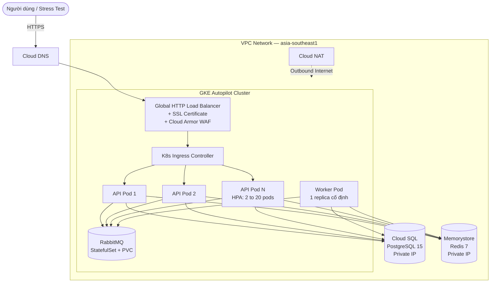
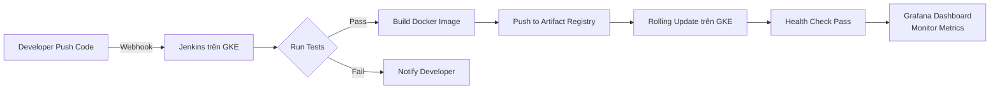

# Kế hoạch Triển khai DevOps — UniHub Workshop trên GCP

> **Bối cảnh:** $200 credit GCP, hết hạn trong 11 ngày. Mục tiêu: trải nghiệm DevOps thực tế end-to-end cho dự án UniHub Workshop (Go Backend + PostgreSQL + Redis + RabbitMQ).

---

## 1. Kiến trúc Hệ thống (System Architecture)



### Giải thích quan trọng

| Thành phần | Vai trò | Cần code không? |
|------------|---------|-----------------|
| **Load Balancer** | Tự động chia đều traffic đến các API Pod | Không — Google cung cấp sẵn, chỉ cần khai báo bằng Terraform + K8s Ingress YAML |
| **Cloud SQL** | Thay thế PostgreSQL local, 1 instance dùng chung cho tất cả Pod | Không — Managed service, chỉ cần đổi connection string |
| **Memorystore** | Thay thế Redis local, 1 instance dùng chung cho tất cả Pod | Không — Managed service, chỉ cần đổi `REDIS_ADDR` |
| **RabbitMQ** | Chạy trên GKE dưới dạng StatefulSet, 1 instance dùng chung | Không — Cài qua Helm chart |
| **HPA** | Tự động nhân bản API Pod khi CPU/traffic tăng (Stress Test) | Không — Khai báo trong file YAML |

> [!TIP]
> **Tất cả các database/cache/queue đều là DUY NHẤT 1 cụm, dùng chung** cho tất cả API Pod replicas. Không bao giờ tạo mỗi Pod một Redis/DB riêng.

---

## 2. Sửa Code Backend cho Horizontal Scaling

Đây là thay đổi **duy nhất** cần làm trong code trước khi deploy. Hiện tại file [main.go](file:///home/tuna/learn/se/UniHub-Workshop/unihub-workshop/src/backend/cmd/server/main.go) đang chạy cả API Server lẫn Background Workers (Cron Jobs) trong cùng 1 process:

```go
// main.go hiện tại — TẤT CẢ chạy chung 1 process
go startRegistrationWorker(ctx, consumer, regService)    // OK (RabbitMQ tự chia message)
go startNotificationWorker(ctx, cfg.RabbitMQURL, notifService) // OK
go startPaymentCleanupWorker(ctx, paymentService)        // NGUY HIỂM khi có nhiều Pod
go startBatchImportScheduler(ctx, batchService)          // NGUY HIỂM khi có nhiều Pod
```

### Vấn đề

Khi HPA scale lên 10 API Pods, cả 10 Pods sẽ đồng loạt chạy `PaymentCleanup` (mỗi 5 phút) và `BatchImport` (lúc 2:00 sáng). Gây ra:
- Tranh chấp Database (Race Condition) khi nhiều Pod cùng xoá 1 payment record
- Import CSV trùng lặp 10 lần

### Phương án sửa: Tách API Server và Worker bằng biến môi trường `APP_MODE`

Thêm 1 biến môi trường `APP_MODE` vào [config.go](file:///home/tuna/learn/se/UniHub-Workshop/unihub-workshop/src/backend/internal/config/config.go):

```diff
 // config.go
 type Config struct {
+    AppMode string // "api" | "worker" | "all" (default cho local dev)
     // ...existing fields...
 }

 func Load() *Config {
     return &Config{
+        AppMode: getEnv("APP_MODE", "all"),
         // ...
     }
 }
```

Sửa `main.go` để điều kiện hoá việc khởi chạy:

```diff
 // main.go
+mode := cfg.AppMode

-// Start background workers
-go startRegistrationWorker(ctx, consumer, regService)
-go startNotificationWorker(ctx, cfg.RabbitMQURL, notifService)
-go startPaymentCleanupWorker(ctx, paymentService)
-go startBatchImportScheduler(ctx, batchService)

+if mode == "worker" || mode == "all" {
+    go startRegistrationWorker(ctx, consumer, regService)
+    go startNotificationWorker(ctx, cfg.RabbitMQURL, notifService)
+    go startPaymentCleanupWorker(ctx, paymentService)
+    go startBatchImportScheduler(ctx, batchService)
+}

-srv := &http.Server{...}
+if mode == "api" || mode == "all" {
+    srv := &http.Server{...}
+    // ... listen and serve
+}
```

Khi deploy lên Kubernetes, chúng ta sẽ tạo **2 Deployment riêng biệt** từ cùng 1 Docker Image:

| K8s Deployment | `APP_MODE` | Replicas | HPA |
|----------------|-----------|----------|-----|
| `unihub-api` | `api` | 2 đến 20 (auto scale) | Có |
| `unihub-worker` | `worker` | 1 (cố định) | Không |

> [!NOTE]
> Khi chạy local (`APP_MODE=all` — mặc định), mọi thứ hoạt động y hệt như hiện tại. Không ảnh hưởng gì đến quá trình phát triển.

---

## 3. Lộ trình Triển khai (4 Giai đoạn)

### Giai đoạn 1: Chuẩn bị Môi trường
1. Cài đặt công cụ: `gcloud CLI`, `terraform`, `kubectl`, `helm`, `docker`.
2. Tạo/chọn GCP Project, login `gcloud auth login`.
3. Enable các API cần thiết (Compute, Kubernetes, Cloud SQL, Memorystore, Cloud DNS, Artifact Registry, Secret Manager).
4. Mua tên miền qua **Cloud Domains** (VD: `unihub-test.dev`, giá khoảng $12/năm).

---

### Giai đoạn 2: Hạ tầng bằng Terraform (Infrastructure as Code)
Viết code Terraform (thư mục `deploy/terraform/`) để tạo:
1. **VPC** + Subnet + Cloud NAT + Firewall Rules.
2. **Cloud SQL** (PostgreSQL 15) — Private IP, automated daily backup.
3. **Memorystore** (Redis 7) — Standard tier, Private IP.
4. **GKE Autopilot** Cluster — kết nối vào VPC.
5. **Artifact Registry** — nơi lưu Docker Image.
6. **Cloud DNS Zone** — trỏ tên miền vào Load Balancer.
7. **Google Secret Manager** — lưu trữ DB password, JWT Secret, RSA Private Key (thay vì hardcode trong `.env`).
8. **IAM and Service Accounts** — quyền tối thiểu (Principle of Least Privilege).

---

### Giai đoạn 3: Container hoá và Deploy lên GKE
1. **Sửa code** Backend (thêm `APP_MODE` như mục 2 ở trên).
2. **Tối ưu Dockerfile** (multi-stage build, non-root user).
3. Build và push Docker Image lên Artifact Registry.
4. Cài **RabbitMQ** lên GKE bằng Helm chart (Bitnami).
5. Viết Kubernetes manifests (thư mục `deploy/k8s/`):
   - `configmap.yaml` — biến môi trường không nhạy cảm
   - `secret.yaml` — kết nối tới Google Secret Manager
   - `deployment-api.yaml` — API server (`APP_MODE=api`, replicas: 2)
   - `deployment-worker.yaml` — Worker (`APP_MODE=worker`, replicas: 1)
   - `service.yaml` — ClusterIP Service
   - `ingress.yaml` — Liên kết với Load Balancer + SSL
   - `hpa.yaml` — Auto scale API pods (CPU > 70% thì scale up, max 20)
6. Chạy Database Migration (file `init_schema.sql` + `002_seed_data.sql`).
7. Verify: Truy cập `https://api.unihub-test.dev/health` trả về `{"status":"ok"}`.

---

### Giai đoạn 4: CI/CD (Jenkins) + Monitoring + Stress Test

#### 4.1 Jenkins CI/CD
1. Cài đặt Jenkins trên GKE (Helm chart).
2. Viết `Jenkinsfile` (pipeline):
   ```
   Stage 1: Checkout code
   Stage 2: Run unit tests (go test)
   Stage 3: Build Docker image
   Stage 4: Push to Artifact Registry
   Stage 5: Rolling update trên GKE (kubectl set image)
   ```
3. Cấu hình Webhook: Khi push code lên Git thì Jenkins tự động chạy pipeline.

#### 4.2 Monitoring và Observability
1. **Google Cloud Monitoring** — Dashboard theo dõi CPU/RAM/Network của GKE + Cloud SQL.
2. **Prometheus + Grafana** (cài trên GKE bằng Helm) — Dashboard chi tiết: request latency (P50/P95/P99), error rate, active connections.
3. **Cloud Logging** — Thu gom log tập trung từ tất cả Pods (có sẵn khi dùng GKE, không cần cài thêm).
4. **Alerting** — Cấu hình cảnh báo: CPU > 90% gửi email, Error Rate > 5% gửi email.

#### 4.3 Stress Test
1. Sử dụng `k6` để bắn traffic lên hệ thống.
2. Quan sát trên Grafana: Latency tăng thì HPA sinh thêm Pod rồi Latency giảm về ổn định.
3. Ghi lại kết quả (so sánh trước/sau scaling).

---

## 4. Cấu trúc Thư mục Deploy (Tạo mới)

```
deploy/
├── terraform/                # Infrastructure as Code
│   ├── main.tf               # Provider, backend config
│   ├── vpc.tf                # VPC, Subnet, NAT, Firewall
│   ├── cloudsql.tf           # PostgreSQL instance
│   ├── memorystore.tf        # Redis instance
│   ├── gke.tf                # GKE Autopilot cluster
│   ├── dns.tf                # Cloud DNS zone + records
│   ├── registry.tf           # Artifact Registry
│   ├── secrets.tf            # Secret Manager
│   ├── iam.tf                # Service accounts and roles
│   ├── variables.tf          # Input variables
│   ├── outputs.tf            # Output values
│   └── terraform.tfvars      # Variable values (gitignored)
│
├── k8s/                      # Kubernetes manifests
│   ├── namespace.yaml
│   ├── configmap.yaml
│   ├── secret.yaml
│   ├── deployment-api.yaml
│   ├── deployment-worker.yaml
│   ├── service.yaml
│   ├── ingress.yaml
│   ├── hpa.yaml
│   └── rabbitmq/
│       └── values.yaml       # Helm values cho RabbitMQ
│
├── jenkins/
│   ├── values.yaml           # Helm values cho Jenkins
│   └── Jenkinsfile           # CI/CD pipeline
│
└── monitoring/
    └── grafana-values.yaml   # Helm values cho Grafana stack
```

---

## 5. Sơ đồ CI/CD Pipeline



---

## 6. Ước tính Chi phí (11 ngày)

| Dịch vụ | Cấu hình | Chi phí ước tính |
|---------|----------|------------------|
| GKE Autopilot | khoảng 3-5 Pod thường xuyên | khoảng $30-50 |
| Cloud SQL | db-f1-micro, 10GB SSD | khoảng $8-12 |
| Memorystore Redis | 1GB Basic | khoảng $5-8 |
| Cloud DNS | 1 zone | khoảng $0.5 |
| Cloud Domains | 1 tên miền .dev | khoảng $12/năm |
| Load Balancer | 1 forwarding rule | khoảng $5-8 |
| Artifact Registry | Storage | khoảng $1 |
| **Tổng (11 ngày)** | | **khoảng $60-90** |

> [!TIP]
> Nằm thoải mái trong ngân sách $200. Sau khi xong, chạy `terraform destroy` để xoá sạch hạ tầng, tránh bị tính phí tiếp.

---

## 7. Security Checklist

- [ ] Không hardcode secret — sử dụng Google Secret Manager
- [ ] Cloud SQL chỉ có Private IP (không Public IP)
- [ ] Memorystore chỉ có Private IP
- [ ] GKE Pods chạy với non-root user
- [ ] Firewall rules: chỉ Load Balancer được gọi vào GKE
- [ ] Network Policy trong K8s: chỉ API Pod được gọi ra RabbitMQ/DB/Redis
- [ ] Xoá `MOCK_SIGNATURE` backdoor trong payment webhook verification
- [ ] CORS chỉ cho phép domain cụ thể

---

Bạn có đồng ý với bản kế hoạch này không? Nếu OK thì chúng ta sẽ bắt đầu **Giai đoạn 1** ngay!
