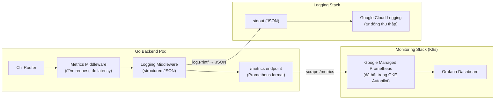

# Observability: Prometheus Metrics + Structured Logging

> **Mục tiêu:** Trang bị 2 trụ cột Observability cho Backend Go — (1) Prometheus metrics endpoint + Grafana dashboard để theo dõi real-time khi Stress Test, (2) Structured JSON logging + Request middleware để debug hiệu quả trên Cloud Logging.

---

## Tổng quan kiến trúc



---

## Proposed Changes

### Component 1: Prometheus Metrics

#### [NEW] [internal/metrics/prometheus.go](file:///home/tuna/learn/se/UniHub-Workshop/unihub-workshop/src/backend/internal/metrics/prometheus.go)

Package chứa tất cả metrics definitions. Sử dụng thư viện `prometheus/client_golang` (thư viện chuẩn của Prometheus).

**Metrics sẽ khai báo:**

| Metric | Kiểu | Mô tả | Labels |
|--------|------|-------|--------|
| `http_requests_total` | Counter | Tổng số request | `method`, `path`, `status` |
| `http_request_duration_seconds` | Histogram | Thời gian xử lý (để tính P50/P95/P99) | `method`, `path` |
| `http_requests_in_flight` | Gauge | Số request đang xử lý đồng thời | — |
| `db_pool_active_connections` | Gauge | Số kết nối DB đang dùng | — |
| `db_pool_idle_connections` | Gauge | Số kết nối DB đang rảnh | — |
| `redis_cache_hits_total` | Counter | Số lần cache hit | — |
| `redis_cache_misses_total` | Counter | Số lần cache miss | — |
| `rabbitmq_messages_published_total` | Counter | Số message đã đẩy vào hàng đợi | `queue` |
| `rabbitmq_messages_consumed_total` | Counter | Số message worker đã xử lý | `queue`, `status` |

---

#### [NEW] [internal/middleware/metrics.go](file:///home/tuna/learn/se/UniHub-Workshop/unihub-workshop/src/backend/internal/middleware/metrics.go)

HTTP Middleware tự động đo lường mọi request đi qua Chi Router:

```go
func MetricsMiddleware(next http.Handler) http.Handler {
    return http.HandlerFunc(func(w http.ResponseWriter, r *http.Request) {
        start := time.Now()
        metrics.RequestsInFlight.Inc()
        defer metrics.RequestsInFlight.Dec()

        // Wrap ResponseWriter để bắt status code
        ww := NewWrappedWriter(w)
        next.ServeHTTP(ww, r)

        duration := time.Since(start).Seconds()
        status := strconv.Itoa(ww.StatusCode)
        path := normalizeChiPath(r)  // /api/v1/workshops/{id} thay vì UUID thật

        metrics.RequestsTotal.WithLabelValues(r.Method, path, status).Inc()
        metrics.RequestDuration.WithLabelValues(r.Method, path).Observe(duration)
    })
}
```

> [!NOTE]
> Hàm `normalizeChiPath()` sẽ dùng `chi.RouteContext` để lấy route pattern (`/api/v1/workshops/{id}`) thay vì path thật (`/api/v1/workshops/abc-123-uuid`). Nếu không normalize, Prometheus sẽ tạo ra hàng triệu time series vô nghĩa gây crash.

---

#### [MODIFY] [cmd/server/main.go](file:///home/tuna/learn/se/UniHub-Workshop/unihub-workshop/src/backend/cmd/server/main.go)

2 thay đổi:

**1. Gắn metrics middleware vào Chi router:**
```diff
 r.Use(chimw.Logger)
 r.Use(chimw.Recoverer)
 r.Use(chimw.RealIP)
+r.Use(middleware.MetricsMiddleware)
 r.Use(chimw.Timeout(30 * time.Second))
```

**2. Thêm route `/metrics` (chỉ khi mode = api hoặc all):**
```diff
 r.Get("/health", func(w http.ResponseWriter, r *http.Request) { ... })

+// Prometheus metrics endpoint
+r.Handle("/metrics", promhttp.Handler())
```

---

#### [NEW] [internal/metrics/db_collector.go](file:///home/tuna/learn/se/UniHub-Workshop/unihub-workshop/src/backend/internal/metrics/db_collector.go)

Collector tự động lấy thông số kết nối DB từ `pgxpool.Pool.Stat()` và cập nhật Gauge metrics:

```go
func StartDBCollector(pool *pgxpool.Pool) {
    go func() {
        ticker := time.NewTicker(15 * time.Second)
        for range ticker.C {
            stat := pool.Stat()
            DBActiveConns.Set(float64(stat.AcquiredConns()))
            DBIdleConns.Set(float64(stat.IdleConns()))
        }
    }()
}
```

---

#### [NEW] [deploy/k8s/podmonitor.yaml](file:///home/tuna/learn/se/UniHub-Workshop/unihub-workshop/deploy/k8s/podmonitor.yaml)

K8s PodMonitor CRD — chỉ dẫn Google Managed Prometheus tự động scrape endpoint `/metrics` từ API pods:

```yaml
apiVersion: monitoring.googleapis.com/v1
kind: PodMonitoring
metadata:
  name: unihub-api-metrics
  namespace: unihub
spec:
  selector:
    matchLabels:
      app: unihub-api
  endpoints:
  - port: http
    path: /metrics
    interval: 15s
```

---

#### [NEW] [deploy/k8s/grafana/](file:///home/tuna/learn/se/UniHub-Workshop/unihub-workshop/deploy/k8s/grafana/) — Grafana Dashboard

| File | Mô tả |
|------|-------|
| `values.yaml` | Helm values cho Grafana (Bitnami/Grafana chart). Datasource tự trỏ vào Google Managed Prometheus |
| `dashboard.json` | Dashboard JSON: 6 panels (Request Rate, Error Rate, P95 Latency, In-Flight, DB Pool, Redis Hit Rate) |

---

### Component 2: Structured JSON Logging + Request Logging Middleware

#### [NEW] [internal/logger/logger.go](file:///home/tuna/learn/se/UniHub-Workshop/unihub-workshop/src/backend/internal/logger/logger.go)

Package logger sử dụng `log/slog` (built-in từ Go 1.21+, không cần dependency ngoài):

```go
package logger

import (
    "log/slog"
    "os"
)

var Log *slog.Logger

func Init() {
    Log = slog.New(slog.NewJSONHandler(os.Stdout, &slog.HandlerOptions{
        Level: slog.LevelInfo,
    }))
    slog.SetDefault(Log)
}
```

**Output mẫu:**
```json
{"time":"2026-05-29T15:30:00Z","level":"INFO","msg":"request completed","method":"POST","path":"/api/v1/registrations","status":201,"latency_ms":42,"user_id":"21127001"}
```

> [!IMPORTANT]
> `log/slog` là thư viện **built-in** của Go 1.21+. Không cần `go get` thêm dependency nào. Tuy nhiên, dự án đang dùng **Go 1.25.5** (theo go.mod) nên hoàn toàn tương thích.

---

#### [NEW] [internal/middleware/logging.go](file:///home/tuna/learn/se/UniHub-Workshop/unihub-workshop/src/backend/internal/middleware/logging.go)

Middleware thay thế `chimw.Logger` mặc định của Chi (chỉ log ra text thuần) bằng structured JSON:

```go
func StructuredLogger(next http.Handler) http.Handler {
    return http.HandlerFunc(func(w http.ResponseWriter, r *http.Request) {
        start := time.Now()
        ww := NewWrappedWriter(w)
        
        next.ServeHTTP(ww, r)

        slog.Info("request completed",
            "method", r.Method,
            "path", r.URL.Path,
            "status", ww.StatusCode,
            "latency_ms", time.Since(start).Milliseconds(),
            "remote_ip", r.RemoteAddr,
            "user_agent", r.UserAgent(),
            "user_id", middleware.GetUserID(r.Context()),
        )
    })
}
```

---

#### [MODIFY] [cmd/server/main.go](file:///home/tuna/learn/se/UniHub-Workshop/unihub-workshop/src/backend/cmd/server/main.go)

Thay thế Chi Logger mặc định:

```diff
+// Initialize structured logger
+logger.Init()

 r := chi.NewRouter()

-r.Use(chimw.Logger)
+r.Use(middleware.StructuredLogger)
 r.Use(chimw.Recoverer)
```

---

#### [MODIFY] Các file sử dụng `log.Printf` (Từng bước thay thế)

Hiện tại codebase dùng `log.Printf("[TAG] message")` ở nhiều nơi. Chúng ta sẽ:
- **Giai đoạn 1 (bây giờ):** Chỉ thêm logger mới + logging middleware. Code cũ dùng `log.Printf` vẫn hoạt động bình thường vì `slog.SetDefault()` sẽ thiết lập JSON output cho toàn bộ `log.Printf` tự động.
- **Giai đoạn 2 (sau này - nếu cần):** Dần dần migrate từng file sang `slog.Info/Error/Warn()` để có structured fields.

> [!NOTE]
> Khi gọi `slog.SetDefault()`, tất cả `log.Printf()` cũ trong codebase sẽ tự động được redirect sang JSON handler. Không cần sửa từng file một!

---

## Tổng kết File Changes

### Files cần tạo mới: 6 files

| File | Mô tả |
|------|-------|
| `internal/metrics/prometheus.go` | Metrics definitions (Counter, Histogram, Gauge) |
| `internal/metrics/db_collector.go` | DB pool stats collector |
| `internal/middleware/metrics.go` | HTTP metrics middleware |
| `internal/middleware/logging.go` | Structured JSON request logger |
| `internal/logger/logger.go` | slog JSON logger init |
| `deploy/k8s/podmonitor.yaml` | GKE Prometheus scrape config |

### Files cần sửa: 2 files

| File | Thay đổi |
|------|----------|
| `cmd/server/main.go` | + import metrics/logger, + `/metrics` route, thay `chimw.Logger` → `StructuredLogger`, + db collector |
| `go.mod` | + `prometheus/client_golang` dependency |

### K8s / Grafana (Tuỳ chọn)

| File | Mô tả |
|------|-------|
| `deploy/k8s/grafana/values.yaml` | Helm values cho Grafana |
| `deploy/k8s/grafana/dashboard.json` | Pre-built dashboard 6 panels |

---

## Open Questions

> [!IMPORTANT]
> **Grafana triển khai kiểu nào?**
> - **Option A:** Cài Grafana trên GKE bằng Helm chart — đẹp, nhưng tốn thêm tài nguyên GKE (~200m CPU, 256Mi RAM)
> - **Option B:** Dùng **Google Cloud Monitoring Console** (miễn phí, sẵn có) — không đẹp bằng Grafana nhưng không tốn chi phí
> - **Option C:** Cả hai — dùng Cloud Monitoring mặc định, cài Grafana khi cần demo đẹp
>
> Bạn muốn chọn option nào? (Khuyến nghị **Option A** vì dashboard Grafana sẽ tạo hiệu ứng WOW khi demo Stress Test)

---

## Verification Plan

### Build Test
1. `go build ./cmd/server/` — verify compile thành công
2. Chạy local → `curl localhost:8080/metrics` trả về Prometheus format
3. Gọi vài API → verify log JSON xuất hiện trên stdout

### K8s Validation  
1. `kubectl apply -f deploy/k8s/podmonitor.yaml` — verify PodMonitoring tạo thành công
2. Google Cloud Monitoring → Metrics Explorer → query `http_requests_total` → verify data xuất hiện
