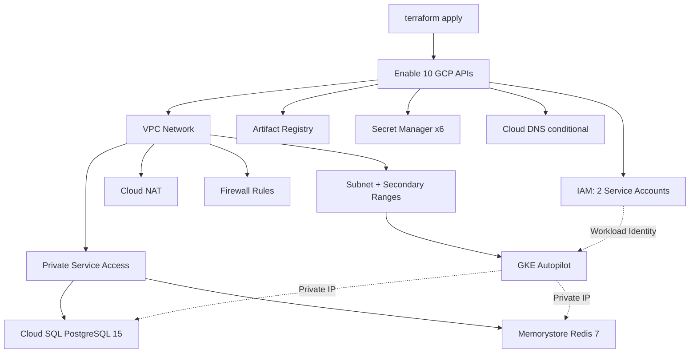
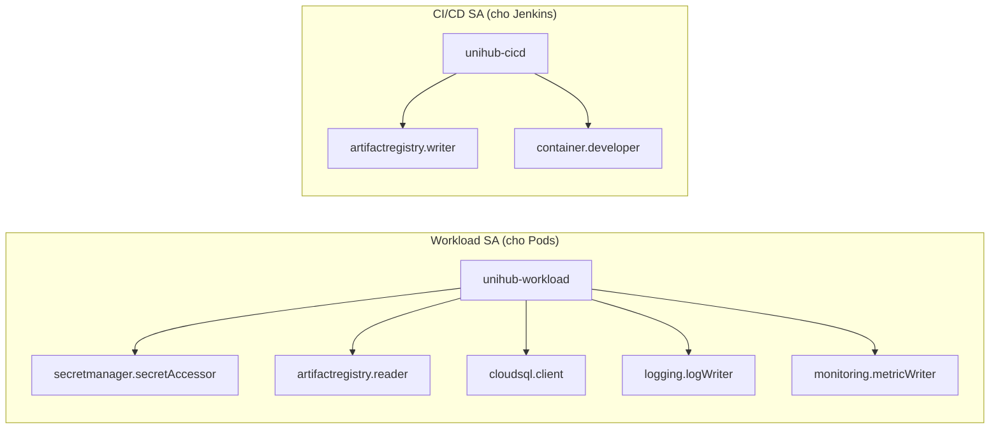
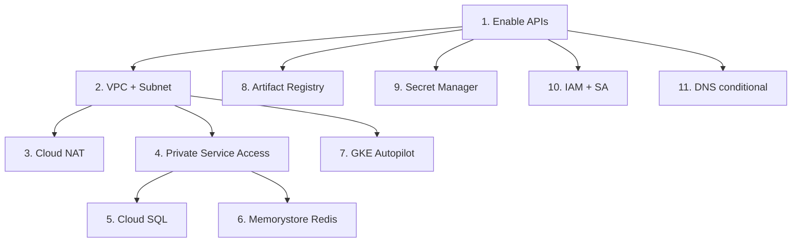

# Giải thích Toàn bộ Cấu hình Terraform — UniHub Workshop

## Tổng quan kiến trúc



Terraform sẽ tạo **tổng cộng ~30 resources** trên GCP, chia thành 10 file `.tf`. Dưới đây giải thích từng file.

---

## 1. `main.tf` — Nền tảng

**Làm gì:** Khai báo provider và bật các API cần thiết trên GCP.

| Block | Mục đích |
|-------|----------|
| `terraform.required_providers` | Dùng Google provider v5.x |
| `provider "google"` | Xác thực project + region |
| `google_project_service.apis` | **Bật 10 API** — nếu không bật, tất cả resource khác sẽ fail |

**10 API được bật:**

| API | Dùng cho |
|-----|----------|
| `compute` | VPC, Firewall, Load Balancer |
| `container` | GKE Kubernetes |
| `sqladmin` | Cloud SQL |
| `redis` | Memorystore |
| `artifactregistry` | Docker images |
| `secretmanager` | Quản lý secrets |
| `dns` | Tên miền |
| `servicenetworking` | Private IP cho SQL/Redis |
| `cloudresourcemanager` | Quản lý project |
| `iam` | Phân quyền |

> [!NOTE]
> `disable_on_destroy = false` nghĩa là khi chạy `terraform destroy`, API vẫn được giữ bật — tránh ảnh hưởng các service khác trong project.

---

## 2. `variables.tf` — Biến đầu vào

Định nghĩa tất cả biến mà các file `.tf` khác tham chiếu. Chia thành các nhóm:

| Nhóm | Biến | Giá trị mặc định |
|------|------|-------------------|
| **GCP** | `project_id`, `region`, `zone` | `asia-southeast1` |
| **VPC** | `vpc_cidr`, `pods_cidr`, `services_cidr` | `10.0.0.0/20`, `10.4.0.0/14`, `10.8.0.0/20` |
| **Cloud SQL** | `db_tier`, `db_name`, `db_user`, `db_password` | `db-f1-micro` |
| **Redis** | `redis_memory_size_gb`, `redis_version` | `1GB`, `REDIS_7_0` |
| **Secrets** | `auth_secret`, `rsa_private_key`, `payment_webhook_secret`... | Bắt buộc nhập |

> [!IMPORTANT]
> Biến có `sensitive = true` sẽ **không hiển thị** trong terminal khi chạy `terraform plan/apply`. Terraform tự mask.

---

## 3. `vpc.tf` — Mạng nội bộ

**Đây là file quan trọng nhất** — tạo nền tảng network cho mọi thứ.

### 3.1 VPC Network
```hcl
auto_create_subnetworks = false  # Tự quản lý subnet, không để Google tạo tự động
routing_mode = "REGIONAL"        # Traffic chỉ trong region asia-southeast1
```

### 3.2 Subnet với 3 dải IP

```
┌─────────────────────────────────────────────┐
│ Subnet: 10.0.0.0/20 (Primary)              │
│   → GKE Nodes, Cloud SQL, Redis            │
│   → 4,094 IP addresses                     │
│                                             │
│ Secondary "pods": 10.4.0.0/14              │
│   → Mỗi Pod nhận 1 IP riêng               │
│   → 262,142 IPs (đủ cho hàng ngàn Pod)    │
│                                             │
│ Secondary "services": 10.8.0.0/20          │
│   → Kubernetes Services (ClusterIP)         │
│   → 4,094 IPs                              │
└─────────────────────────────────────────────┘
```

**Tại sao cần secondary ranges?** GKE yêu cầu IP riêng cho mỗi Pod (VPC-native networking). Nếu dùng chung dải chính, sẽ hết IP rất nhanh khi scale.

### 3.3 Cloud NAT

```
GKE Pods (Private IP) → Cloud NAT → Internet
```

Các Pod không có Public IP. Muốn gọi ra ngoài (VD: gọi Gemini API, gửi email SMTP) thì traffic phải đi qua Cloud NAT.

### 3.4 Private Service Access

```
VPC ←──VPC Peering──→ Google Service Network
                         ├── Cloud SQL (Private IP)
                         └── Memorystore (Private IP)
```

Đây là cơ chế cho phép Cloud SQL và Redis có **Private IP** trong VPC. Traffic từ Pod → Database **không đi qua internet**, mà đi qua kết nối peering nội bộ → nhanh hơn + an toàn hơn.

### 3.5 Firewall Rules

| Rule | Source | Ports | Mục đích |
|------|--------|-------|----------|
| `allow-internal` | `10.0.0.0/20`, `10.4.0.0/14`, `10.8.0.0/20` | Tất cả | Pod ↔ Pod, Pod ↔ DB tự do |
| `allow-health-check` | `35.191.0.0/16`, `130.211.0.0/22` | 80, 443, 8080 | Google LB kiểm tra Pod còn sống |

> [!NOTE]
> `35.191.0.0/16` và `130.211.0.0/22` là **dải IP cố định** của Google Health Check. Không bật rule này → Load Balancer nghĩ Pod chết → không route traffic.

---

## 4. `cloudsql.tf` — PostgreSQL Database

Tạo 3 resources: **Instance** → **Database** → **User**

### Cấu hình quan trọng:

| Setting | Giá trị | Giải thích |
|---------|---------|------------|
| `ipv4_enabled = false` | Chỉ Private IP | Không ai trên internet truy cập được DB |
| `tier = db-f1-micro` | 0.6GB RAM | Nhỏ nhất, tiết kiệm credit |
| `disk_type = PD_SSD` | SSD | Nhanh hơn HDD |
| `disk_autoresize = true` | Tự mở rộng | Không lo hết disk |
| `backup_configuration` | Daily 3AM UTC | Backup tự động + PITR (Point-in-Time Recovery) |
| `max_connections = 100` | 100 connections | Đủ cho 20 Pods x 5 connections/pod |
| `log_min_duration_statement = 1000` | 1 giây | Log mọi query chậm hơn 1s |
| `deletion_protection = false` | Tắt | Để `terraform destroy` được — **bật ON** khi production thật |

---

## 5. `memorystore.tf` — Redis Cache

| Setting | Giá trị | Giải thích |
|---------|---------|------------|
| `tier = BASIC` | Không HA | Tiết kiệm credit, dùng `STANDARD_HA` cho prod |
| `memory_size_gb = 1` | 1 GB | Đủ cho cache seat, waiting room, rate limiter |
| `maxmemory-policy = allkeys-lru` | LRU eviction | Khi đầy → xoá key ít dùng nhất |
| `notify-keyspace-events = Ex` | TTL events | Khi key hết hạn → Redis gửi notification → dùng cho seat expiration |

---

## 6. `gke.tf` — Kubernetes Cluster

### Autopilot vs Standard

```
Standard: Bạn tự quản lý nodes (chọn máy, số lượng, upgrade...)
Autopilot: Google quản lý 100% → bạn chỉ cần deploy Pods
```

Chọn **Autopilot** vì: tiết kiệm công sức + tự scale nodes + trả tiền theo Pod dùng thật.

### Cấu hình quan trọng:

| Setting | Giải thích |
|---------|------------|
| `enable_private_nodes = true` | Nodes không có Public IP → an toàn |
| `enable_private_endpoint = false` | Control plane vẫn có Public IP → chạy `kubectl` từ laptop được |
| `master_ipv4_cidr_block = 172.16.0.0/28` | Dải IP riêng cho K8s control plane |
| `workload_identity_config` | Pod dùng GCP Service Account **không cần** JSON key file |
| `managed_prometheus = true` | Google tự cài Prometheus → export metrics tự động |
| `release_channel = REGULAR` | Nhận K8s version updates theo lịch ổn định |

### Workload Identity là gì?

```
Cách cũ (KHÔNG AN TOÀN):
  Tạo JSON key file → mount vào Pod → Pod dùng key để gọi GCP API

Cách mới (Workload Identity):
  K8s ServiceAccount "unihub-api" ←binding→ GCP ServiceAccount "unihub-workload"
  Pod tự động có quyền, KHÔNG CẦN key file
```

---

## 7. `registry.tf` — Docker Image Storage

```
Build Docker Image → Push lên Artifact Registry → GKE pull về chạy
```

| Setting | Giải thích |
|---------|------------|
| `format = DOCKER` | Lưu Docker images |
| `cleanup_policies.keep_count = 10` | Chỉ giữ 10 image mới nhất → tự xoá cũ → tiết kiệm storage |

URL sẽ có dạng: `asia-southeast1-docker.pkg.dev/PROJECT_ID/unihub-docker/unihub-api:latest`

---

## 8. `secrets.tf` — Quản lý Secrets

Tạo **6 cặp** (secret container + secret version):

| Secret | Chứa gì | Ai dùng |
|--------|---------|---------|
| `unihub-db-password` | Mật khẩu PostgreSQL | Pod qua env var |
| `unihub-auth-secret` | JWT signing key | Auth middleware |
| `unihub-rsa-private-key` | RSA key ký vé QR | Ticket service |
| `unihub-payment-webhook-secret` | Verify payment callback | Payment handler |
| `unihub-smtp-pass` | Gmail App Password | Email service |
| `unihub-gemini-api-key` | Gemini API key | AI summary |

### Tại sao dùng Secret Manager thay vì K8s Secrets?

```
K8s Secrets:     Base64 encoded (KHÔNG phải encrypted!) → ai có kubectl đọc được
Secret Manager:  Encrypted at rest + audit log + version control + IAM controlled
```

### `replication { auto {} }` nghĩa gì?

Google tự chọn region tốt nhất để replicate secret. Không cần chỉ định thủ công.

---

## 9. `iam.tf` — Phân quyền (Least Privilege)

### 2 Service Accounts:



| SA | Quyền | Tại sao cần |
|----|-------|-------------|
| **Workload** | `secretAccessor` | Đọc DB password, JWT secret từ Secret Manager |
| | `artifactregistry.reader` | Pull Docker image |
| | `cloudsql.client` | Kết nối PostgreSQL qua Cloud SQL Proxy |
| | `logWriter` | Ghi log vào Cloud Logging |
| | `metricWriter` | Gửi metrics cho Prometheus/Monitoring |
| **CI/CD** | `artifactregistry.writer` | Push Docker image mới |
| | `container.developer` | Deploy (kubectl apply) lên GKE |

### Workload Identity Binding

```hcl
member = "serviceAccount:PROJECT.svc.id.goog[unihub/unihub-api]"
#                                             ───────  ──────────
#                                             namespace  K8s SA name
```

Khi tạo K8s ServiceAccount `unihub-api` trong namespace `unihub` và annotate nó với GCP SA email → Pod tự động có quyền mà **không cần JSON key**.

---

## 10. `dns.tf` — Tên miền (Conditional)

```hcl
count = var.domain_name != "" ? 1 : 0  # Chỉ tạo khi có domain
```

Nếu `domain_name = ""` (mặc định) → **không tạo gì**. Khi mua domain rồi, điền vào `terraform.tfvars` → Terraform tạo DNS zone.

DNSSEC được bật để chống DNS spoofing.

---

## 11. `outputs.tf` — Kết quả sau Apply

Sau `terraform apply`, Terraform in ra các giá trị cần thiết cho bước tiếp theo (K8s manifests):

| Output | Ví dụ | Dùng ở đâu |
|--------|-------|------------|
| `cloudsql_private_ip` | `10.0.1.5` | K8s ConfigMap `DB_HOST` |
| `redis_addr` | `10.0.2.3:6379` | K8s ConfigMap `REDIS_ADDR` |
| `docker_registry_url` | `asia-southeast1-docker.pkg.dev/proj/unihub-docker` | Dockerfile push/pull |
| `kubectl_config_command` | `gcloud container clusters get-credentials...` | Kết nối kubectl |
| `workload_sa_email` | `unihub-workload@proj.iam.gserviceaccount.com` | K8s SA annotation |

---

## Thứ tự Terraform tạo Resources



Terraform tự phân tích `depends_on` và references (`google_compute_network.vpc.id`) để xác định thứ tự. Không cần chỉ định thủ công — trừ khi có implicit dependency.

---

## Tóm tắt: Mapping Docker Local → GCP

| Local (docker-compose) | GCP (Terraform) |
|------------------------|-----------------|
| `postgres:16-alpine` container | Cloud SQL PostgreSQL 15 (`cloudsql.tf`) |
| `redis:7-alpine` container | Memorystore Redis 7 (`memorystore.tf`) |
| `rabbitmq:3-management` container | RabbitMQ Helm chart trên GKE (giai đoạn 3) |
| `mailhog` container | Gmail SMTP thật (qua Secret Manager) |
| `.env` file | Secret Manager + K8s ConfigMap |
| `localhost:8080` | GKE Ingress + Load Balancer |
